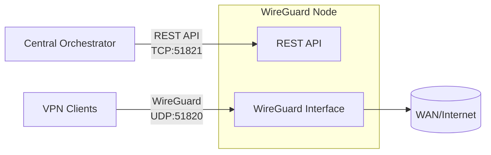

<p align="center">
  
</p>

<h1 align="center">WGKeeper Node</h1>

<p align="center"><strong>REST API-driven WireGuard node for centralized orchestration.</strong></p>

<p align="center">
  <a href="https://github.com/wgkeeper/wgkeeper-node/actions/workflows/ci.yml"></a>
  <a href="https://github.com/wgkeeper/wgkeeper-node/blob/main/LICENSE"></a>
  <a href="https://github.com/wgkeeper/wgkeeper-node/releases/latest"></a>
  <a href="https://github.com/wgkeeper/wgkeeper-node/pkgs/container/node"></a>
  <a href="https://codecov.io/gh/wgkeeper/wgkeeper-node"></a>
  <a href="https://goreportcard.com/report/github.com/wgkeeper/wgkeeper-node"></a>
  <a href="https://pkg.go.dev/github.com/wgkeeper/wgkeeper-node"></a>
  <a href="https://github.com/wgkeeper/wgkeeper-node/blob/main/go.mod"></a>
</p>

---

WGKeeper Node runs a WireGuard interface on a Linux host and exposes a **REST API** for peer management. It is built to be a minimal, secure node controlled by a single orchestrator that manages many nodes over HTTP.

- **Orchestration-first** — manage hundreds of nodes from one control plane
- **Security-focused** — small attack surface, API key auth, optional IP allowlists, rate limiting
- **Production-ready** — WireGuard stats, peer lifecycle, optional persistence, TLS, security headers

## Table of contents

- [Why this project](#why-this-project)
- [Features](#features)
- [Architecture](#architecture)
- [Security](#security)
- [Requirements](#requirements)
- [Quick start](#quick-start)
- [Configuration](#configuration)
- [Deployment](#deployment)
  - [Docker Compose — local](#docker-compose--local)
  - [Docker Compose — production with Caddy](#docker-compose--production-with-caddy)
  - [Running locally](#running-locally)
- [Performance benchmarks](#performance-benchmarks)
- [API reference](#api-reference)
- [Peer store persistence](#peer-store-persistence)
- [Trademark](#trademark)

---

## Why this project

Managing WireGuard at scale means coordinating dozens or hundreds of nodes: adding and removing peers, rotating keys, tracking expiry, and staying consistent after reboots — all without manual `wg` commands on each machine.

WGKeeper Node is the agent that runs on every host. It exposes a single, consistent REST API so a central orchestrator can manage any node identically — regardless of how many there are. Each node stays **lean and security-focused**: small surface area, strict API key auth, post-quantum preshared keys per peer, and no dependency on any external service.

## Features

| Area | Capabilities |
|------|--------------|
| **Orchestration** | Central API layer to manage many nodes; automatic IP allocation and key rotation |
| **Security** | API key auth, optional IP allowlists, rate limiting, TLS, security headers, request ID for tracing |
| **Resilience** | Post-quantum preshared keys per peer; optional file-based peer store persistence |
| **Observability** | WireGuard stats, peer activity, auto-generated client configs |

## Architecture



## Security

| Mechanism | Details |
|-----------|---------|
| **API key auth** | All protected endpoints require `X-API-Key`; `/healthz` and `/readyz` are public |
| **IP allowlist** | `server.allowed_ips` — when set, only listed IPs/CIDRs can reach protected routes |
| **Trusted proxies** | Only `127.0.0.1` and `::1` are trusted as reverse proxies, preventing `X-Forwarded-For` spoofing from external clients |
| **Rate limiting** | 20 req/s per client IP, burst 30; automatically disabled when an allowlist is configured |
| **Body limit** | 256 KB maximum; larger requests get `413 Request Entity Too Large` |
| **Input validation** | Pagination `offset` must be ≥ 0 and `limit` between 1–1000; invalid values return `400 Bad Request` |
| **Config validation** | `wireguard.routing.wan_interface` is validated against a safe character set (letters, digits, `-`, `_`, `.`) to prevent injection into routing rules |
| **Security headers** | `X-Content-Type-Options`, `X-Frame-Options`, `X-XSS-Protection`, `Referrer-Policy`; `Strict-Transport-Security` when TLS is enabled |
| **Request tracing** | Every response includes `X-Request-Id` (UUID v4) |
| **WireGuard config** | Written with mode `0600`; minimal host surface |
## Requirements

| | Requirement |
|---|-------------|
| **Host** | Linux with WireGuard kernel support; root or `CAP_NET_ADMIN` |
| **Docker** | Capabilities `NET_ADMIN` and `SYS_MODULE` |
| **Bare metal** | `wireguard-tools`, `iproute2`, `iptables` |

## Quick start

1. **Clone and enter the repo**
   ```bash
   git clone https://github.com/wgkeeper/wgkeeper-node.git && cd wgkeeper-node
   ```

2. **Copy and edit config**
   ```bash
   cp config.example.yaml config.yaml
   # Edit server.port, auth.api_key, wireguard.* as needed
   ```

3. **Run with Docker Compose**
   ```bash
   docker compose up -d
   ```
   API: `http://localhost:51821` · WireGuard UDP: `51820`

4. **Create a peer**
   ```bash
   curl -X POST http://localhost:51821/peers \
     -H "X-API-Key: YOUR_API_KEY" \
     -H "Content-Type: application/json" \
     -d '{"peerId":"7c2f3f7a-6b4e-4f3f-8b2a-1a9b3c2d4e5f"}'
   ```

## Configuration

Config is loaded from `./config.yaml` by default. Override the path:

```bash
NODE_CONFIG=/path/to/config.yaml
```

`DEBUG=true` or `DEBUG=1` enables verbose logs and detailed API error responses. Do not use in production.

### Server

| Setting | Description |
|---------|-------------|
| `server.port` | API port (HTTP, or HTTPS if TLS is configured) |
| `server.tls_cert` | Path to TLS certificate PEM file; must be set together with `tls_key` |
| `server.tls_key` | Path to TLS private key PEM file; must be set together with `tls_cert` |
| `server.allowed_ips` | Optional IPv4/IPv6 addresses or CIDRs; when set, only these IPs can call protected endpoints |
| `auth.api_key` | API key for all protected endpoints |

### WireGuard

| Setting | Description |
|---------|-------------|
| `wireguard.interface` | Interface name (e.g. `wg0`) |
| `wireguard.listen_port` | WireGuard UDP listen port |
| `wireguard.subnet` | IPv4 CIDR for peer IP allocation (max prefix `/30`); at least one of `subnet`/`subnet6` is required |
| `wireguard.server_ip` | Optional IPv4 address for the server within the subnet |
| `wireguard.subnet6` | IPv6 CIDR for peer IP allocation (max prefix `/126`); optional when `subnet` is set |
| `wireguard.server_ip6` | Optional IPv6 address for the server within the subnet |
| `wireguard.routing.wan_interface` | WAN interface used for NAT rules (e.g. `eth0`); only letters, digits, `-`, `_`, `.` are accepted |
| `wireguard.peer_store_file` | Optional path to a bbolt DB file for persistent peer storage |

## Deployment

On startup, the node creates `/etc/wireguard/<interface>.conf` if it does not exist and brings the interface up. In Docker this is handled by `entrypoint.sh` before `wg-quick up`. When running without root, `./wireguard/<interface>.conf` is used instead.

### Docker Compose — local

Suitable for local use and simple setups. Uses `docker-compose.local.yml`.

1. Copy config:
   ```bash
   cp config.example.yaml config.yaml
   ```

2. *(Optional)* Place TLS certificates in `./certs/`. If not using HTTPS, remove or comment the `./certs:/app/certs:ro` volume in the compose file.

3. Start:
   ```bash
   docker compose -f docker-compose.local.yml up -d
   ```

The compose file uses `ghcr.io/wgkeeper/node:1.0.0` (or `edge` for the latest `main` build), with `NET_ADMIN` + `SYS_MODULE` capabilities, volumes for `config.yaml` and `./wireguard`, and ports `51820/udp` and `51821`. IPv4/IPv6 forwarding sysctls and an IPv6-capable network are preconfigured; adjust as needed for your environment.

### Docker Compose — production with Caddy

Uses `docker-compose.prod-secure.yml` — the REST API is never exposed directly on the host. [Caddy](https://caddyserver.com) is the only HTTP(S) entrypoint.

**Network layout:**

| Service | Host ports | Internal |
|---------|-----------|----------|
| `wireguard` | `51820/udp` | REST API on `51821` (Docker-internal only) |
| `caddy` | `80`, `443` | Reverse-proxies to `wireguard:51821` |

**Start:**
```bash
docker compose -f docker-compose.prod-secure.yml up -d
```

**Recommended settings for production:**

- Use a long, random `auth.api_key`.
- Set `server.allowed_ips` to your orchestrator's IPs — only those can call protected endpoints.
- Restrict ports `80` and `443` at the firewall to your orchestrator only.
- Point a domain at the node (e.g. `api.example.com`) for automatic HTTPS via Let's Encrypt.

**Example `Caddyfile`:**

```Caddyfile
# Replace :443 with your domain for automatic HTTPS
:443 {
    encode gzip zstd
    reverse_proxy wireguard:51821
}
```

Customisation tips:
- **Domain:** replace `:443` with `api.example.com` — Caddy provisions certificates automatically when ports 80/443 are reachable.
- **Different API port:** update `reverse_proxy wireguard:<port>` to match `server.port` in `config.yaml`.
- The `caddy` service uses a stock `caddy:2` image — extend the `Caddyfile` freely.

### Running locally

1. Copy config:
   ```bash
   cp config.example.yaml config.yaml
   ```

2. Run:
   ```bash
   go run ./cmd/server
   ```

**Available subcommands:**

| Command | Description |
|---------|-------------|
| *(no args)* | Start the API server |
| `init` | Ensure WireGuard config exists, then exit |
| `init --print-path` | Same as `init`, also prints the config file path to stdout |

## Performance benchmarks

The latest benchmark snapshot is published in `docs/benchmarks.md`.

Use CI PR benchmark comparison as the source of truth for regression checks, and use the snapshot for a quick overview.

## API reference

All protected endpoints require the `X-API-Key` header. Every response includes `X-Request-Id` (UUID v4).

| Method | Path | Auth | Description |
|--------|------|------|-------------|
| `GET` | `/healthz` | public | Liveness probe — process is up |
| `GET` | `/readyz` | public | Readiness probe — WireGuard backend is available |
| `GET` | `/stats` | required | WireGuard interface statistics |
| `GET` | `/peers` | required | List peers (paginated) |
| `GET` | `/peers/:peerId` | required | Peer details and traffic stats |
| `POST` | `/peers` | required | Create or rotate a peer |
| `DELETE` | `/peers/:peerId` | required | Delete a peer |

---

### GET /stats

```bash
curl http://localhost:51821/stats -H "X-API-Key: <your-api-key>"
```

```json
{
  "service": { "name": "wgkeeper-node", "version": "1.0.0" },
  "wireguard": {
    "interface": "wg0",
    "listenPort": 51820,
    "subnets": ["10.0.0.0/24", "fd00::/112"],
    "serverIps": ["10.0.0.1", "fd00::1"],
    "addressFamilies": ["IPv4", "IPv6"]
  },
  "peers": { "possible": 253, "issued": 0, "active": 0 },
  "startedAt": "2026-02-02T00:06:06Z"
}
```

---

### GET /peers

Returns a paginated list of peers.

**Query params:**

| Param | Default | Description |
|-------|---------|-------------|
| `offset` | `0` | Number of items to skip; must be ≥ 0 |
| `limit` | all | Maximum items to return; must be between 1 and 1000 |

Invalid values return `400 Bad Request`.

```bash
curl "http://localhost:51821/peers?offset=0&limit=50" \
  -H "X-API-Key: <your-api-key>"
```

```json
{
  "data": [
    {
      "peerId": "7c2f3f7a-6b4e-4f3f-8b2a-1a9b3c2d4e5f",
      "allowedIPs": ["10.0.0.2/32"],
      "addressFamilies": ["IPv4"]
    }
  ],
  "meta": {
    "offset": 0,
    "limit": 50,
    "totalItems": 42,
    "hasPrev": false,
    "hasNext": false
  }
}
```

---

### POST /peers

Creates a new peer, or rotates keys if the peer already exists.

**Request body:**

| Field | Required | Description |
|-------|----------|-------------|
| `peerId` | yes | UUIDv4 peer identifier |
| `expiresAt` | no | RFC3339 timestamp; omit for a permanent peer |
| `addressFamilies` | no | `["IPv4"]`, `["IPv6"]`, or `["IPv4","IPv6"]`; omit to use all families the node supports |

```bash
curl -X POST http://localhost:51821/peers \
  -H "X-API-Key: <your-api-key>" \
  -H "Content-Type: application/json" \
  -d '{"peerId":"7c2f3f7a-6b4e-4f3f-8b2a-1a9b3c2d4e5f"}'
```

The response contains everything the client needs to configure WireGuard:

```json
{
  "server": {
    "publicKey": "<server-public-key>",
    "listenPort": 51820
  },
  "peer": {
    "peerId": "7c2f3f7a-6b4e-4f3f-8b2a-1a9b3c2d4e5f",
    "publicKey": "<peer-public-key>",
    "privateKey": "<peer-private-key>",
    "presharedKey": "<preshared-key>",
    "allowedIPs": ["10.0.0.2/32"],
    "addressFamilies": ["IPv4"]
  }
}
```

> **Note:** The private key is returned only on creation and is never stored by the node.

---

### DELETE /peers/:peerId

```bash
curl -X DELETE http://localhost:51821/peers/7c2f3f7a-6b4e-4f3f-8b2a-1a9b3c2d4e5f \
  -H "X-API-Key: <your-api-key>"
```

## Peer store persistence

By default, peer state is in-memory only and is lost on restart. Enable persistence by setting `wireguard.peer_store_file` to a writable path (e.g. `/var/lib/wgkeeper/peers.db`).

**Lifecycle:**

| Event | Behaviour |
|-------|-----------|
| Startup — file missing | Start with an empty store |
| Startup — invalid/corrupted DB data or duplicate `peer_id`/`public_key` | Startup fails with a clear error |
| Startup — file valid | Restore all peers to the WireGuard device; remove any peers outside the current subnets |
| Peer created / rotated / deleted | Store is written atomically (temp file + rename) |
| Host reboot, interface recreated | Load file; re-add all stored peers to the device |
| Subnet changed in config | On next startup, peers outside the new subnets are removed from the store and device |

**Storage format:** bbolt database file with peer records keyed by `peer_id` and containing `public_key`, `preshared_key`, `allowed_ips`, `created_at`, and optional `expires_at`. Private keys are never stored. The DB file is created with mode `0600` — create its directory with tight permissions.

## Trademark

WireGuard® is a registered trademark of Jason A. Donenfeld.
