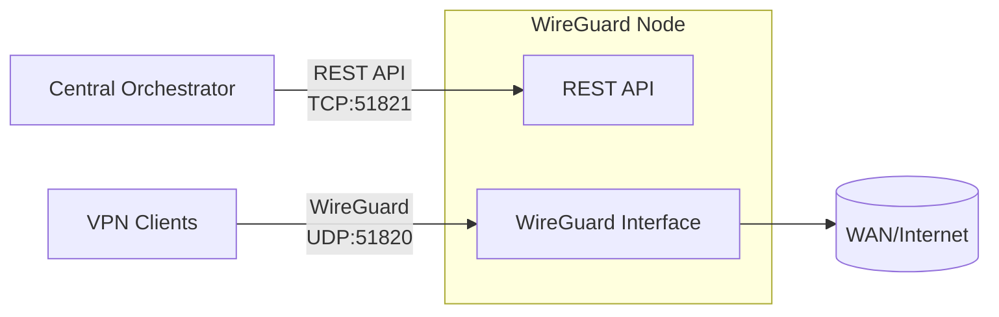

<p align="center">
  
</p>

<h1 align="center">WGKeeper Node</h1>

<p align="center"><strong>REST API-driven WireGuard node for centralized orchestration.</strong></p>

[](https://github.com/wgkeeper/wgkeeper-node/actions/workflows/ci.yml)
[](https://github.com/wgkeeper/wgkeeper-node/blob/main/LICENSE)
[](https://github.com/wgkeeper/wgkeeper-node/releases/latest)
[](https://github.com/wgkeeper/wgkeeper-node/pkgs/container/node)
[](https://codecov.io/gh/wgkeeper/wgkeeper-node)
[](https://goreportcard.com/report/github.com/wgkeeper/wgkeeper-node)
[](https://pkg.go.dev/github.com/wgkeeper/wgkeeper-node)
[](https://github.com/wgkeeper/wgkeeper-node/blob/main/go.mod)

---

WGKeeper Node runs a WireGuard interface on a Linux host and exposes a **REST API** for peer management. It is built to be a minimal, secure node controlled by a single orchestrator that manages many nodes over HTTP.

- **Orchestration-first** — manage hundreds of nodes from one control plane
- **Security-focused** — small attack surface, API key auth, optional IP allowlists, rate limiting
- **Production-ready** — WireGuard stats, peer lifecycle, optional persistence, TLS, security headers

## Table of contents

- [Architecture](#architecture)
- [Security](#security)
- [Requirements](#requirements)
- [Quick start](#quick-start)
- [Configuration](#configuration)
- [Deployment](#deployment)
  - [Docker Compose — local](#docker-compose--local)
  - [Docker Compose — production with Caddy](#docker-compose--production-with-caddy)
  - [Running locally](#running-locally)
- [Performance benchmarks](#performance-benchmarks)
- [API reference](#api-reference)
- [Peer store persistence](#peer-store-persistence)
- [Metrics](#metrics)
- [Testing](#testing)
- [Trademark](#trademark)

---

## Architecture



## Security

| Mechanism | Details |
|-----------|---------|
| **API key auth** | All protected endpoints require `X-API-Key`; `/healthz` and `/readyz` are public |
| **IP allowlist** | `server.allowed_ips` — optional; when configured, acts as an independent layer on top of API key auth so a request must pass both checks |
| **Trusted proxies** | Only `127.0.0.1` and `::1` are trusted as reverse proxies, preventing `X-Forwarded-For` spoofing from external clients |
| **Rate limiting** | 20 req/s per client IP, burst 30; automatically disabled when an allowlist is configured |
| **Body limit** | 256 KB maximum; larger requests get `413 Request Entity Too Large` |
| **Input validation** | Pagination `offset` must be ≥ 0 and `limit` between 1–1000; invalid values return `400 Bad Request` |
| **Config validation** | `wireguard.routing.wan_interface` is validated against a safe character set (letters, digits, `-`, `_`, `.`) to prevent injection into routing rules |
| **Security headers** | `X-Content-Type-Options`, `X-Frame-Options`, `X-XSS-Protection`, `Referrer-Policy`; `Strict-Transport-Security` when TLS is enabled |
| **Request tracing** | Every response includes `X-Request-Id` (UUID v4) |
| **WireGuard config** | Written with mode `0600`; minimal host surface |
## Requirements

| | Requirement |
|---|-------------|
| **Host** | Linux with WireGuard kernel support; root or `CAP_NET_ADMIN` |
| **Docker** | Capabilities `NET_ADMIN` and `SYS_MODULE` |
| **Bare metal** | `wireguard-tools`, `iproute2`, `iptables` |

## Quick start

1. **Clone and enter the repo**
   ```bash
   git clone https://github.com/wgkeeper/wgkeeper-node.git && cd wgkeeper-node
   ```

2. **Copy and edit config**
   ```bash
   cp config.example.yaml config.yaml
   # Edit server.port, auth.api_key, wireguard.* as needed
   ```

3. **Run with Docker Compose**
   ```bash
   docker compose up -d
   ```
   API: `http://localhost:51821` · WireGuard UDP: `51820`

4. **Create a peer** — see [API reference](#api-reference)

## Configuration

Config is loaded from `./config.yaml` by default. Override the path:

```bash
NODE_CONFIG=/path/to/config.yaml
```

`DEBUG=true` or `DEBUG=1` enables verbose logs and detailed API error responses. Do not use in production.

### Server

| Setting | Description |
|---------|-------------|
| `server.port` | API port (HTTP, or HTTPS if TLS is configured) |
| `server.tls_cert` | Path to TLS certificate PEM file; must be set together with `tls_key` |
| `server.tls_key` | Path to TLS private key PEM file; must be set together with `tls_cert` |
| `server.allowed_ips` | Optional IPv4/IPv6 addresses or CIDRs; when set, only these IPs can call protected endpoints |
| `auth.api_key` | API key for all protected endpoints |

### WireGuard

| Setting | Description |
|---------|-------------|
| `wireguard.interface` | Interface name (e.g. `wg0`) |
| `wireguard.listen_port` | WireGuard UDP listen port |
| `wireguard.subnet` | IPv4 CIDR for peer IP allocation (max prefix `/30`); at least one of `subnet`/`subnet6` is required |
| `wireguard.server_ip` | Optional IPv4 address for the server within the subnet |
| `wireguard.subnet6` | IPv6 CIDR for peer IP allocation (max prefix `/126`); optional when `subnet` is set |
| `wireguard.server_ip6` | Optional IPv6 address for the server within the subnet |
| `wireguard.routing.wan_interface` | WAN interface used for NAT rules (e.g. `eth0`); only letters, digits, `-`, `_`, `.` are accepted |
| `wireguard.peer_store_file` | Optional path to a bbolt DB file for persistent peer storage |

## Deployment

On startup, the node creates `/etc/wireguard/<interface>.conf` if it does not exist and brings the interface up. In Docker this is handled by `entrypoint.sh` before `wg-quick up`. When running without root, `./wireguard/<interface>.conf` is used instead.

### Docker Compose — local

Suitable for local use and simple setups. Uses `docker-compose.local.yml`.

1. Copy config:
   ```bash
   cp config.example.yaml config.yaml
   ```

2. *(Optional)* Place TLS certificates in `./certs/`. If not using HTTPS, remove or comment the `./certs:/app/certs:ro` volume in the compose file.

3. Start:
   ```bash
   docker compose -f docker-compose.local.yml up -d
   ```

The compose file uses `ghcr.io/wgkeeper/node:1.3.0` (or `edge` for the latest `main` build), with `NET_ADMIN` + `SYS_MODULE` capabilities, volumes for `config.yaml` and `./wireguard`, and ports `51820/udp` and `51821`. IPv4/IPv6 forwarding sysctls and an IPv6-capable network are preconfigured; adjust as needed for your environment.

### Docker Compose — production with Caddy

Uses `docker-compose.prod-secure.yml` — the REST API is never exposed directly on the host. [Caddy](https://caddyserver.com) is the only HTTP(S) entrypoint.

**Network layout:**

| Service | Host ports | Internal |
|---------|-----------|----------|
| `wireguard` | `51820/udp` | REST API on `51821` (Docker-internal only) |
| `caddy` | `80`, `443` | Reverse-proxies to `wireguard:51821` |

**Start:**
```bash
docker compose -f docker-compose.prod-secure.yml up -d
```

**Recommended settings for production:**

- Use a long, random `auth.api_key`.
- Set `server.allowed_ips` to your orchestrator's IPs — only those can call protected endpoints.
- Restrict ports `80` and `443` at the firewall to your orchestrator only.
- Point a domain at the node (e.g. `api.example.com`) for automatic HTTPS via Let's Encrypt.

**Example `Caddyfile`:**

```Caddyfile
# Replace :443 with your domain for automatic HTTPS
:443 {
    encode gzip zstd
    reverse_proxy wireguard:51821
}
```

Customisation tips:
- **Domain:** replace `:443` with `api.example.com` — Caddy provisions certificates automatically when ports 80/443 are reachable.
- **Different API port:** update `reverse_proxy wireguard:<port>` to match `server.port` in `config.yaml`.
- The `caddy` service uses a stock `caddy:2` image — extend the `Caddyfile` freely.

### Running locally

1. Copy config:
   ```bash
   cp config.example.yaml config.yaml
   ```

2. Run:
   ```bash
   go run ./cmd/server
   ```

**Available subcommands:**

| Command | Description |
|---------|-------------|
| *(no args)* | Start the API server |
| `init` | Ensure WireGuard config exists, then exit |
| `init --print-path` | Same as `init`, also prints the config file path to stdout |

## Performance benchmarks

The latest benchmark snapshot is published in `docs/benchmarks.md`.

Use CI PR benchmark comparison as the source of truth for regression checks, and use the snapshot for a quick overview.

## API reference

All protected endpoints require the `X-API-Key` header. Every response includes `X-Request-Id` (UUID v4).

| Method | Path | Auth | Description |
|--------|------|------|-------------|
| `GET` | `/healthz` | public | Liveness probe — process is up |
| `GET` | `/readyz` | public | Readiness probe — WireGuard backend is available |
| `GET` | `/stats` | required | WireGuard interface statistics |
| `GET` | `/peers` | required | List peers (paginated) |
| `GET` | `/peers/:peerId` | required | Peer details and traffic stats |
| `POST` | `/peers` | required | Create or rotate a peer |
| `DELETE` | `/peers/:peerId` | required | Delete a peer |

---

### GET /stats

Returns service metadata and WireGuard interface statistics: interface name, listen port, configured subnets, server IPs, address families, and peer counts (possible, issued, active).

---

### GET /peers

Returns a paginated list of peers. Each item includes `peerId`, `publicKey`, `allowedIPs`, `addressFamilies`, `active`, `lastHandshakeAt`, `createdAt`, and `expiresAt`.

**Query params:**

| Param | Default | Description |
|-------|---------|-------------|
| `offset` | `0` | Number of items to skip; must be ≥ 0 |
| `limit` | all | Maximum items to return; must be between 1 and 1000 |

Invalid values return `400 Bad Request`.

---

### POST /peers

Creates a new peer, or rotates keys if the peer already exists. Key rotation preserves the peer's allocated IP — existing firewall rules and client configs remain valid.

**Request body:**

| Field | Required | Description |
|-------|----------|-------------|
| `peerId` | yes | UUIDv4 peer identifier |
| `expiresAt` | no | RFC3339 timestamp; omit for a permanent peer. Expired peers are removed automatically by the node's background cleanup — no orchestrator action required |
| `addressFamilies` | no | `["IPv4"]`, `["IPv6"]`, or `["IPv4","IPv6"]`; omit to use all families the node supports |

The response includes server public key and listen port, plus peer public key, private key, preshared key, and allocated IPs. The private key is returned only on creation and is never stored by the node.

Returns `409` if no IP addresses are available in the subnet.

---

### GET /peers/:peerId

Returns full details for a single peer: all fields from the list endpoint plus `receiveBytes` and `transmitBytes` traffic counters from the WireGuard kernel. Returns `404` if the peer does not exist.

---

### DELETE /peers/:peerId

Removes the peer from the WireGuard interface and the peer store. Returns `404` if the peer does not exist.

## Peer store persistence

By default, peer state is in-memory only and is lost on restart. Enable persistence by setting `wireguard.peer_store_file` to a writable path (e.g. `/var/lib/wgkeeper/peers.db`).

**The peer store is the source of truth for managed state.** On startup the node reconciles the WireGuard device against the store in both directions: peers in the store but missing on the device are re-installed, and peers on the device whose public key is not in the store are silently removed. The latter recovers cleanly from a crash mid-write and from any out-of-band `wg set` calls — anything not tracked through the API does not survive a restart.

**Writes are crash-safe.** Peer create, rotate, and delete persist to bbolt *before* the WireGuard device is mutated. If the kernel call fails to persist is rolled back; if the process crashes between persist and device update, startup reconcile installs the new state on the device. Clients that already received their private key in the HTTP response keep working across restarts.

**Lifecycle:**

| Event | Behaviour |
|-------|-----------|
| Startup — file missing | Start with an empty store; remove any peers found on the device |
| Startup — invalid/corrupted DB data or duplicate `peer_id`/`public_key` | Startup fails with a clear error |
| Startup — file valid | Re-install stored peers on the device; remove peers from the device whose key is not in the store; remove peers outside the current subnets |
| Peer created / rotated / deleted | Persist runs before the device is mutated; on device-error the persist is rolled back |
| Host reboot, interface recreated | Load file; re-add all stored peers to the device |
| Subnet changed in config | On next startup, peers outside the new subnets are removed from the store and device |
| Peer expires (`expiresAt` reached) | Removed automatically by a background goroutine; no orchestrator action required |

**Storage format:** bbolt database file with peer records keyed by `peer_id` and containing `public_key`, `preshared_key`, `allowed_ips`, `created_at`, and optional `expires_at`. Private keys are never stored. The DB file is created with mode `0600` — create its directory with tight permissions.

## Metrics

Optional Prometheus `/metrics` endpoint. Off by default. When enabled it runs on its own HTTP listener with mandatory bearer auth, separate from the API key.

### Configuration

```yaml
metrics:
  port: 9090
  token: "<32+ random chars; generate with openssl rand -hex 32>"
```

Both fields are required when enabled. `token` **must** differ from `auth.api_key` — startup fails otherwise. Token shorter than 32 characters is rejected.

### What's exposed

| Metric | Type | Labels | Use |
|--------|------|--------|-----|
| `wgkeeper_peers` | gauge | `state="possible\|issued\|active"` | capacity / utilisation |
| `wgkeeper_peer_operations_total` | counter | `op`, `result` | error rate, throughput |
| `wgkeeper_peer_operation_duration_seconds` | histogram | `op` | p99 latency |
| `wgkeeper_persist_rollback_total` | counter | `op` | crash-safety rollbacks fired |
| `wgkeeper_persist_rollback_failed_total` | counter | — | **page on this** — bbolt holds a record device-write rolled back from |
| `wgkeeper_wireguard_rx_bytes_total` | counter | — | total received bytes across all peers |
| `wgkeeper_wireguard_tx_bytes_total` | counter | — | total transmitted bytes across all peers |
| `wgkeeper_wireguard_stale_peers` | gauge | — | peers with no handshake in last 5 min (degradation signal) |
| `wgkeeper_http_requests_total` | counter | `method`, `path`, `status_class` | API throughput, error rate, 401-burst detection |
| `wgkeeper_http_request_duration_seconds` | histogram | `method`, `path` | per-endpoint p99 latency |
| `process_*`, `go_*` | — | — | standard process and Go runtime |

The `path` label uses the route template (e.g. `/peers/:peerId`), never the raw URL — UUIDs would explode cardinality. Unmatched routes (404s) are bucketed under `path="unmatched"`.

### Per-peer metrics (opt-in)

Enable with `metrics.per_peer: true` to expose:

| Metric | Type | Labels |
|--------|------|--------|
| `wgkeeper_peer_rx_bytes_total` | counter | `peer_id`, `allowed_ip` |
| `wgkeeper_peer_tx_bytes_total` | counter | `peer_id`, `allowed_ip` |
| `wgkeeper_peer_last_handshake_seconds` | gauge (age) | `peer_id`, `allowed_ip` |
| `wgkeeper_peers_capped` | gauge | — |

`metrics.per_peer_max` caps cardinality. The collector keeps the **top-N peers by current scrape-window traffic** — quieter peers fall out of metrics but remain visible via `GET /peers/:id`. `wgkeeper_peers_capped` reports how many peers were excluded so the operator never has false confidence in coverage.

**Cardinality scaling:**

| Active peers | Recommended `per_peer_max` | Series count | 30-day storage |
|--------------|----------------------------|--------------|----------------|
| < 500 | 500 | ~1 500 | ~30 MB |
| 500 – 2 000 | 200 | ~600 | ~13 MB |
| 2 000 – 10 000 | 100 *(default)* | ~300 | ~7 MB |
| 10 000+ | 50 | ~150 | ~3 MB |
| 50 000+ | keep `per_peer: false`; drill down via REST `GET /peers/:id` |

For deployments running many wgkeeper nodes with thousands of peers each, consider `vmagent` push-based remote_write to VictoriaMetrics or Prometheus Mimir — both are drop-in compatible with this exporter.

### ⚠️ Do not publish the metrics port on the host

In Docker, **never** add `9090:9090` to `ports:`. Operational signal (peer counts, version, capacity) on the public internet without mTLS is a recon channel. Keep the endpoint inside the Docker network and let Prometheus scrape via service name.

### Pattern: Prometheus in the same compose

```yaml
# config.yaml
metrics:
  port: 9090
  token: "<your token>"
```

```yaml
# docker-compose.local.yml — uncomment the prometheus block
prometheus:
  image: prom/prometheus:v3.1.0
  volumes:
    - ./prometheus.yml:/etc/prometheus/prometheus.yml:ro
    - ./wgkeeper-token:/etc/prometheus/wgkeeper-token:ro
  # No `ports:` — scrape only from inside Docker network.
```

Token file:
```bash
openssl rand -hex 32 | tee ./wgkeeper-token
# (paste the same value into config.yaml's metrics.token)
```

Sample [`prometheus.yml`](docs/prometheus.example.yml) is in `docs/`.

### Pattern: production with Caddy

The `docker-compose.prod-secure.yml` setup keeps the REST API behind Caddy and never publishes it on the host. The same applies to `/metrics` — leave it on the internal network. For external scraping, either:

- run Prometheus in the same compose (recommended), or
- add a separate Caddy site (e.g. `metrics.example.com`) with **client cert auth (mTLS)** that proxies to `wireguard:9090`.

Do not expose `/metrics` over the public internet behind only the bearer token.

### Pattern: bare metal / loopback

Bind to localhost so only same-host scrapers (typically a node-exporter sidecar or `prometheus-agent`) can reach it:

```yaml
metrics:
  port: 9090
  token: "<your token>"
```

The endpoint binds on all interfaces inside the host or container; on bare metal pair this with a firewall rule limiting `9090/tcp` to `127.0.0.1`.

## Testing

```bash
# Run all tests
go test ./...

# Run benchmarks
go test -bench=. ./...
```

Test coverage spans: HTTP handlers and middleware (auth, rate limiting, body limit, security headers, request ID), peer store (CRUD, pagination, persistence), WireGuard service (peer lifecycle, IP allocation, key rotation, expiry cleanup), and config validation.

## Trademark

WireGuard® is a registered trademark of Jason A. Donenfeld.
